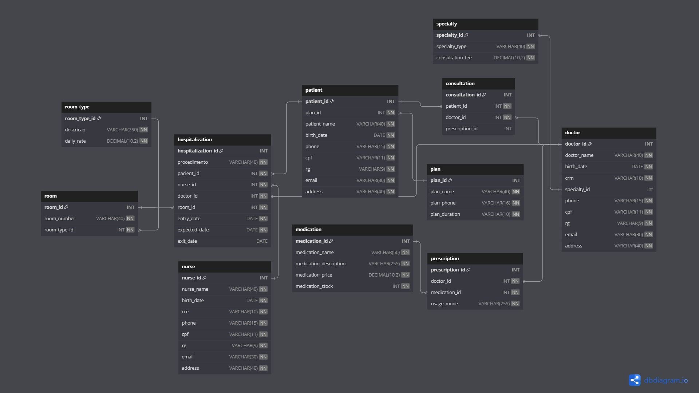
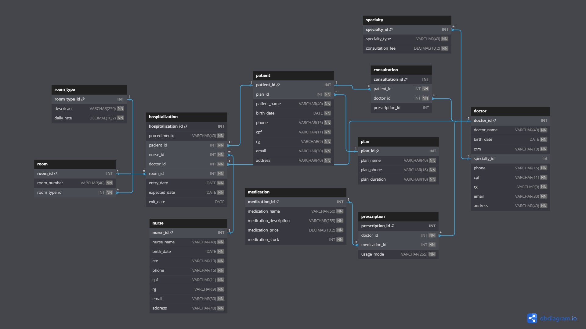

# Os Segredos do Hospital

Este repositório contém o código SQL para a implementação de um banco de dados relacionado ao sistema hospitalar, como parte de uma atividade do curso. O projeto inicial visava gerenciar informações básicas, mas houve a necessidade de expandir as funcionalidades para incluir o controle de internações de pacientes.

## Expansão das Funcionalidades

Após a primeira versão do projeto, foram identificados requisitos adicionais para a versão atualizada do software. Agora, o sistema contempla o controle de internações, vinculando-as a quartos, profissionais de enfermagem, pacientes e médicos. Abaixo estão os principais elementos adicionados:

- **Tabelas Adicionadas:**
  - `room_type`: Descreve os tipos de quartos disponíveis no hospital.
  - `plan`: Representa os planos de saúde.
  - `specialty`: Contém informações sobre as especialidades médicas.
  - `medication`: Armazena dados sobre os medicamentos disponíveis no hospital.
  - `room`: Reflete os quartos disponíveis no hospital.
  - `patient`: Contém informações sobre os pacientes.
  - `doctor`: Armazena dados dos médicos.
  - `nurse`: Contém informações sobre os enfermeiros.
  - `hospitalization`: Registra dados relacionados às internações.
  - `consultation`: Mantém informações sobre as consultas realizadas.
  - `prescription`: Armazena as receitas médicas.

## Diagrama do Banco de Dados 
 
## Relacionamentos Detalhados 


## Código SQL

Abaixo está o código SQL que implementa o banco de dados atualizado:

```sql

-- O código SQL está disponível no arquivo `hospital_database.sql` neste repositório.

CREATE DATABASE hospital;

```

## Instruções de Uso

1. Execute o script SQL no seu sistema de gerenciamento de banco de dados para criar o banco de dados e suas tabelas.
2. Adapte o código conforme necessário para atender aos requisitos específicos do seu ambiente.

## Contribuições

Contribuições são bem-vindas! Sinta-se à vontade para propor melhorias, corrigir bugs ou adicionar novos recursos.

## Contato

Para mais informações ou dúvidas, entre em contato com [seu_nome@exemplo.com].

🚀 Boa codificação!

---

*Este projeto faz parte da atividade "Os Segredos do Hospital" do curso [Proa].*
